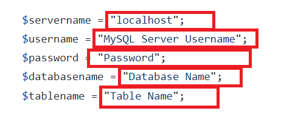

# Detect refer code in app automaticly
ㅤ
<h1><p align="center">
  
</p>
</h1>

> Version 1

<b>Refer Code Detection</b> is a php code toolkit to detect refer code in your App. For example someone download your app from your website now you can detect referral code in your App automaticlly. 

## What's your need?

* A MySQL database with this 👇 database structure.

<p align="center">
  
</p>


## How to use?

Fill all the information in the PHP code. And upload in your server.

<p align="left">
  
</p>

## Documentation
* Call this 👇 method to store refer code

```https://api.example.com/v1/DetectReferCode?method=store&refer_code=TEST_REFER_CODE```

* Call this 👇 method to get refer code
 
 ```https://api.example.com/v1/DetectReferCode?method=get```
 
 ## Credits
 
Image by pikisuperstar on [Freepik](https://www.freepik.com/free-vector/people-making-money-from-referral-concept-illustration_5453369.htm#query=referral&position=1&from_view=keyword)
